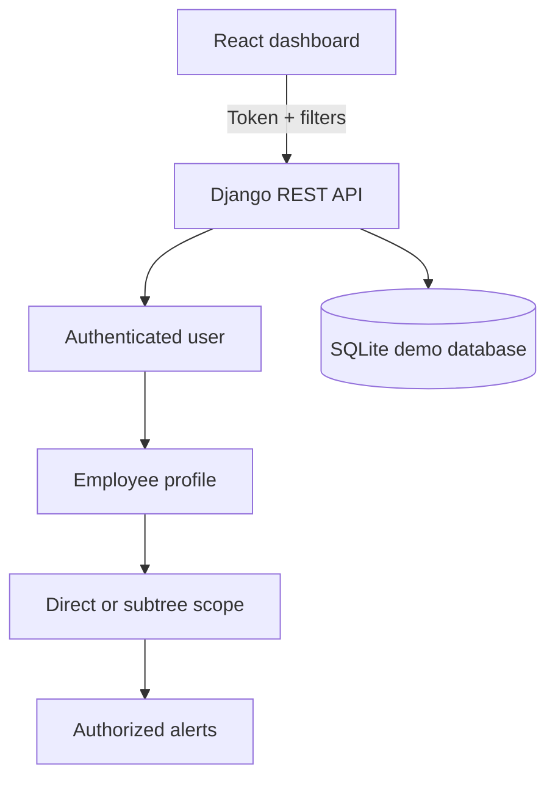

# Alerts Monitoring Dashboard

A security-conscious operations dashboard for managers to review, filter, and dismiss employee alerts across an organisational hierarchy. The React/TypeScript client talks to a Django REST API with token authentication, manager-scoped queries, object-level dismissal authorization, and bounded server-side pagination.

> Portfolio project: this demonstrates the architecture and controls expected in an internal operational tool. It is not presented as a deployed production service.


## Business problem

Managers need one reliable view of operational alerts without exposing records from unrelated teams. The system supports:

- direct-report and full-subtree views;
- severity, status, and employee-name filters;
- bounded, server-side pagination;
- idempotent alert dismissal; and
- authenticated, manager-scoped access.

## Security model

The client never chooses which manager it is acting as. Each API token belongs to a Django user, that user is linked to one employee profile, and the backend derives the manager from the authenticated identity.

- Anonymous requests return `401`.
- Supplying another `manager_id` cannot impersonate that manager.
- List queries only include the authenticated manager's direct reports or descendants.
- Dismissal performs an object-level subtree check and returns `404` for an out-of-scope alert.
- Tokens are accepted through the `Authorization: Token …` header.
- The demo UI stores a manually entered token in `sessionStorage`, not persistent browser storage.
- Django secret key, debug mode, and allowed hosts are environment-controlled.

The local demo token is for development only. A production deployment should use HTTPS, short-lived identity-provider tokens, token rotation, audit events, restrictive CORS settings, and a managed secrets store.

## Architecture



Key decisions:

- A self-referential `Employee.reports_to` relationship models the hierarchy.
- Breadth-first traversal includes cycle protection for malformed org data.
- Authorization is calculated server-side and reused for list and mutation paths.
- Dismissal is idempotent, so retries do not create conflicting state.
- Pagination is capped at 50 records even when a caller requests more.
- Invalid scope, severity, or status values fail explicitly with `400` responses.

## Local setup

### Backend

Requires Python 3.12+.

```bash
python -m venv .venv
source .venv/bin/activate
pip install -r requirements.txt
python backend/manage.py migrate
python backend/manage.py seed_alerts
python backend/manage.py runserver
```

The idempotent seed command creates the sample hierarchy, alerts, a `demo-manager` user, and prints its API token. Run it again at any time without duplicating the sample records.

Optional Django environment variables:

```bash
export DJANGO_SECRET_KEY="replace-me"
export DJANGO_DEBUG="true"
export DJANGO_ALLOWED_HOSTS="localhost,127.0.0.1"
```

### Frontend

Requires Node.js 22+.

```bash
cd alerts-frontend
npm ci
npm start
```

Open `http://localhost:3000` and paste the token printed by `seed_alerts`. Alternatively, copy `.env.example` to `.env.local`, set `REACT_APP_API_TOKEN`, and restart the development server.

## API examples

```bash
curl -H "Authorization: Token $ALERTS_TOKEN" \
  "http://localhost:8000/api/alerts?scope=subtree&severity=high&status=open&page=1"

curl -X POST -H "Authorization: Token $ALERTS_TOKEN" \
  "http://localhost:8000/api/alerts/ALT001/dismiss"
```

## Verification

The GitHub Actions workflow runs these independent gates on every push and pull request:

```bash
# Backend: migrations, framework checks, authorization/filter/pagination tests,
# and an 80% coverage floor
python backend/manage.py check
python backend/manage.py makemigrations --check --dry-run
pytest backend --cov=backend/alerts --cov-report=term-missing --cov-fail-under=80

# Frontend: locked dependency install and production TypeScript build
cd alerts-frontend
npm ci
CI=true npm run build
```

The test suite specifically covers anonymous rejection, cross-manager impersonation attempts, out-of-scope dismissal, idempotent dismissal, nested-report visibility, combined filters, invalid values, empty results, and pagination limits.

## Project structure

```text
alerts-monitoring-dashboard/
├── .github/workflows/ci.yml
├── alerts-frontend/
│   └── src/
│       ├── components/
│       ├── services/api.ts
│       └── types/
├── backend/
│   ├── alerts/
│   │   ├── management/commands/seed_alerts.py
│   │   ├── migrations/
│   │   ├── models.py
│   │   ├── services.py
│   │   ├── tests
│   │   └── views.py
│   └── diversio_backend/
└── requirements.txt
```

## Author

Gwer Msughter Donatus — Backend / Full-Stack Engineer

- [GitHub](https://github.com/Gwerdonatus)
- [LinkedIn](https://linkedin.com/in/donatus-gwer)
- [Portfolio](https://donatus-gwer.vercel.app)
